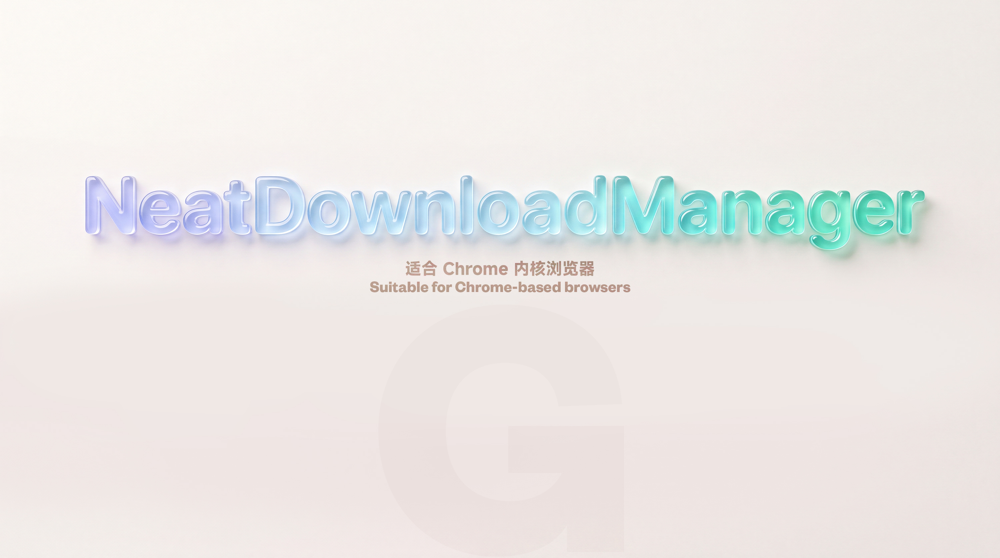

<h1 align="center">NeatDownloadManager-Extension</h1>

  

  

官方的 NeatDownloadManager Extension 没办法屏蔽某一个网站的下载导致屏幕上出现一堆下载框，这个扩展在原有的扩展中添加了屏蔽网站的功能。

<h3 align="center">之前 Before</h3>

  

<h3 align="center">之后 After</h3>

  

## Chrome 安装

1. 下载并解压扩展(点击本页面右上角绿色的 **Code** 按钮，然后选择 **Download ZIP**。)
2. 打开 Chrome 扩展程序
3. 开启右上角的 "开发者模式"
4. 把 NeatDownloadManager-Extension 文件夹拖到 Chrome 扩展程序中

注意：解压后的 NeatDownloadManager-Extension 文件夹不能删除，否则无法使用，可以存放到固定位置

## 使用方法

在目标网站右键点击 **Block downloads** 后刷新一下页面。如果要打开下载在目标网站右键点击 **Download** 。

## 更新日志

2025-12-30

- 修改屏蔽网站逻辑
- 之前很多网站的下载链接都是通过 js 动态生成的，现在可以正常工作
- 缩短了菜单文本：
  - "Download by NeatDownloadManager"改成"Download"
  - "Block downloads from this website"改成"Block downloads"
  - "Unblock downloads from this website"改成"Unblock downloads"

2026-02-02

- 添加图片展示

2026-02-06

- 添加安装说明

2026-3-16  均有 [Leenshady](https://github.com/Leenshady) 提供帮助

- 修复被屏蔽的网站所有下载链接会被拦截问题，现在被屏蔽的网址所有的下载链接都会绕过NDM且被放行
- 增加临时绕过NDM下载功能，按住Ctrl键点击下载链接可以绕过NDM进行下载

2026-07-05 均有 [Leenshady](https://github.com/Leenshady) 提供帮助

1. 优化绕过NDM下载的逻辑，提高成功率；
2. 修复某些情况下blockhosts失效、关闭扩展失效的问题；
3. 修复上下文菜单块下载和ublock下载名称更新不及时问题；
4. 增加绕过下载的热键，现在按住ctrl、alt、Windows/Command、shift键点击下载链接绕过NDM进行下载。

2026-07-09

* 修改 README.md
